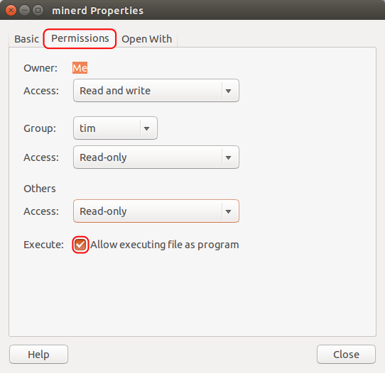

# LS-PrePost Environment Setup to work in LS-Dyna in Unix OSs
This repository will shed light on the installation procedure for LS-PrePost: a free pre- and post-processing software used for LS-Dyna, developed by its parent company LSTC. It can be considered as a step-by-step guide to install and run LS-Dyna in Ubuntu or similar Unix operating systems.

## Prerequisite
The documentation, tutorials and the program will require **at least 900 MB** of free space.

## First Time LS-PrePost Installation

LS-PrePost is a freeware developed by LSTC. Its main purpose was to establish a GUI tool for generating the keyword file for the LS-Dyna solver. It has most of the capabilities to create geometry and meshes, assign boundary conditions, and perform advanced manipulation like all those commercial preprocessors available for LS-Dyna ([Oasys](https://www.oasys-software.com/dyna/software/), [HyperMesh](https://www.altair.com/hypermesh), [ANSA](https://www.beta-cae.com/ansa.htm)), if not all. It can also be used as a post-processor to open and work with the output files from the solver.

The installation of LS-PrePost is quite straightforward. You just have to open the terminal in your machine and copy the following commands there:

### Computer Installation

```bash
# Go to the home directory of the user
cd ~
# Clone this repository from GitHub
git clone https://github.com/dastonmoy/LS-PrePost.git
# Enter into the folder
cd ./LS-PrePost
# Run the installer, it will do everything for you.
# When running the installer, you will also need to include the full name of the
# LS-PrePost version you intend to install. 
# For example, if you want to install the LS-PrePost v4.10, you will go to
# https://ftp.lstc.com/anonymous/outgoing/lsprepost/, select the directory 4.10,
# open the directory named linux64. Then all the LS-PrePost subversions
# available will be displayed. From there, you will just select and copy the latest one named as
# "lsprepost-4.10.5-common_gtk3-23Jun2023.tgz" for installation. In that case:
bash install_lsprepost.sh lsprepost-4.10.5-common_gtk3-23Jun2023.tgz
# Remove the GitHub repo
rm -rf ~/LS-PrePost
# Testing the installation by trying out a first run
while true; do
    read -n 1 -p "Do you wish to use LS-PrePost Now? (y/n) " yn
    case $yn in
        [Yy]* ) cd ~/Desktop; ./LS-PrePost; exit;;
        [Nn]* ) exit;;
        * ) echo "Please answer y or n.";;
    esac
done
```
For any subsequent access to the software, you just need to make the symlink "LS-PrePost" stored in your desktop directory [as "executable"](#opening-ls-prepost-after-installation).


### Server Installation

For installation on the server, just changing the cloning repository to wget would suffice:

```bash
# Go to home directory of the user
cd ~
# Clone the installation file to a newly created directory
mkdir LS-PrePost; cd ~/LS-PrePost
wget https://raw.githubusercontent.com/dastonmoy/LS-PrePost/main/install_lsprepost.sh
# Run the installer, it would do everything for you.
# When running the installer, you will also need to include the full name of the
# LS-PrePost version you intend to install. 
# For example, I want to install the LS-PrePost v4.10. I will go to
# https://ftp.lstc.com/anonymous/outgoing/lsprepost/, select the directory 4.10,
# open the directory named linux64. Then all the LS-PrePost subversions
# available will be exposed. From where I will just select and copy the latest one named as
# "lsprepost-4.10.5-common_gtk3-23Jun2023.tgz" for installation. In that case:
bash install_lsprepost.sh lsprepost-4.10.5-common_gtk3-23Jun2023.tgz
# Remove the github repo
rm -rf ~/LS-PrePost
# Testing the installation by trying out a first run
while true; do
    read -n 1 -p "Do you wish to use LS-PrePost Now? (y/n) " yn
    case $yn in
        [Yy]* ) cd ~/Desktop; ./LS-PrePost; exit;;
        [Nn]* ) exit;;
        * ) echo "Please answer y or n.";;
    esac
done
```
Similary to the computer installation, the server installation also has a simlink created in the desktop for easily running the software.

## Opening LS-PrePost After Installation
For any subsequent access to the software, you just have to make the script created on your desktop as “executable”. To do so, please go to the “Desktop” of your computer and select “LS-PrePost”. Then go to the “Permissions” tab at the top of the dialogue box. Finally, mark the program as executable, like this:




Now, just double-click on the program on your desktop and run PrePost!